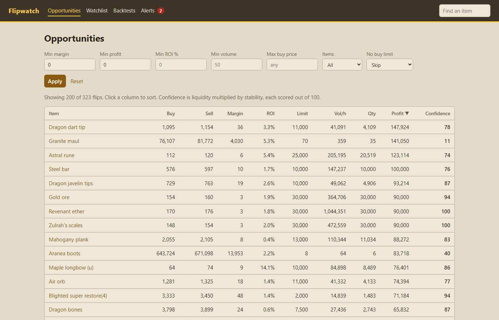

# OSRS Flipwatch

Finds profitable Grand Exchange flips in Old School RuneScape, backtests flipping strategies against historic prices and alerts you in a dashboard when a good margin opens up.



## What it does

Flipping means buying an item on the Grand Exchange at the price sellers dump it for and selling it at the price buyers pay to get it straight away. Flipwatch watches every tradeable item, works out which gaps are still worth taking once the 2% tax is paid, and ranks them by how much they could make within the buy limit and recent trading volume. Each flip carries a confidence score, because a big margin on a handful of trades is usually a trap.

It can also record price history, replay that history through a trading strategy to estimate how it would have done, and show everything in a local dashboard that raises an alert when a flip worth making appears.

## How it works

All prices come from the OSRS Wiki real-time prices API, which reports the latest instant buy and sell price for every item and averages over five minute and one hour windows. The client identifies itself to the wiki, caches item data for a day and prices for a minute, and only ever uses the bulk endpoints for the whole market.

The scanner combines the latest prices with last hour's volume to find flips, applying the tax rules, buy limits and the filters described below. The collector saves the five minute averages to a SQLite database on a schedule, and the backtester replays them through a strategy with a deliberately cautious model of which offers would have filled.

The dashboard is a small Flask app over the same code. It shows the scan, a chart for each item, a watchlist, backtest results and alerts, so the command line and the browser always agree.

## Quick start

You need Python 3.12 or later. On Windows:

```
git clone https://github.com/Jatzo/OSRS-Flipping-Tool.git
cd OSRS-Flipping-Tool
python -m venv .venv
.venv\Scripts\activate
pip install -e ".[dev]"
copy .env.example .env
```

On macOS or Linux, activate with `source .venv/bin/activate` and copy with `cp .env.example .env`.

Open `.env` and set `FLIPWATCH_USER_AGENT` to something that names the project and gives your own contact, such as your GitHub address. The OSRS Wiki blocks requests that do not identify themselves, and the example value points at this repository rather than at you.

Then try it:

```
flipwatch scan
flipwatch collect --once
flask --app flipwatch.web run
```

The last command starts the dashboard at http://127.0.0.1:5000.

To run the tests and the linter:

```
pytest
ruff check .
ruff format --check .
```

## Finding flips

```
flipwatch scan
flipwatch scan --sort roi --min-roi 2 --max-price 5000000
flipwatch scan --f2p --top 50
```

The scan compares the latest instant buy and instant sell price for every item. The idea is to place a buy offer at the instant sell price and a sell offer at the instant buy price, so the margin is the gap between them minus the 2% Grand Exchange tax, which is capped at 5,000,000 coins per item and waived for a short list of exempt items.

Items are skipped when either price is more than 10 minutes old, when the margin after tax is under 10 coins, when fewer than 50 trades happened on the thinner side of the market in the last hour, or when the potential profit is under 500,000 coins. A margin of a few coins vanishes the moment someone undercuts by one, and a small profit is not worth tying up an offer slot for four hours. Pass `--min-margin 0 --min-profit 0 --min-volume 0` to drop those floors. Items with no listed buy limit are skipped too, unless you pass `--no-limit-policy volume`. Old school bonds are always left out, because a bond bought on the Grand Exchange becomes untradeable and costs 10% of its value to make tradeable again.

Quantity is the lower of the buy limit and 10% of last hour's volume on the thinner side. A buy offer fills against people selling instantly and a sell offer fills against people buying instantly, so the quieter side is what limits a flip. Potential profit is margin times quantity.

Large margins on tiny volume are often traps, so each flip has a confidence score from 0 to 100. It is liquidity multiplied by stability. Liquidity rises with the logarithm of hourly volume and reaches full marks at 500 trades an hour. Stability measures how far the latest prices sit from last hour's averages and drops to zero once either side has moved 10%. A one coin difference is ignored so cheap items are not marked down for rounding.

Run `flipwatch scan --help` for every option.

## Planning your slots

```
flipwatch plan
flipwatch plan --capital 20m --slots 3 --f2p
```

A single flip rarely makes much on its own. What matters is what all your offer slots make together, so the plan fills each slot in turn with the flip that adds the most profit for the cash you have left. When the cash cannot cover an item's full quantity it buys fewer rather than skipping it, and each item takes one slot at most. Flips with a confidence below 40 are left out, and the 500,000 coin profit floor does not apply, since a smaller flip can still be the best use of a spare slot.

It shows each flip, the cash used and left over, and the profit for one round. Buy limits reset every four hours, so it also gives a rough hourly figure that assumes every offer fills within that time. The dashboard has the same plan on its Plan page.

## Collecting price history

Backtests need history, so the collector stores the five minute averages for every traded item in a local SQLite database.

```
flipwatch collect
flipwatch collect --once
flipwatch seed 4151 11802 --timestep 1h
flipwatch status
```

`flipwatch collect` runs until you stop it with Ctrl+C. It wakes 30 seconds after each five minute boundary, stores the window that has just closed and checks the last hour for gaps, fetching any window it missed. Use `--once` to run a single pass from cron or Task Scheduler instead. A window that the API has not published yet is left for the next run rather than stored as empty, so `flipwatch status` can report real gaps.

`flipwatch seed` fills in recent history for a few items from the timeseries endpoint, up to 365 windows each. It is limited to 10 items per call to keep requests to the wiki light.

Storing the whole market takes roughly 30 MB a day, so about 3 GB at the default retention of 90 days. Older data is deleted on each run. Change this with `FLIPWATCH_RETENTION_DAYS`, or set it to 0 to keep everything.

## Backtesting

```
flipwatch backtest
flipwatch backtest --strategy dip --days 3 --capital 20m
flipwatch backtest --items 4151 11802 --timestep 1h --start 2026-09-01
```

A backtest replays stored price history through a strategy and reports realised profit, profit per hour, fill rate, peak capital used, maximum drawdown and a breakdown per item. Each run is saved to the database. By default it trades the 50 items with the most volume in the period, starting with 50,000,000 coins.

Two example strategies are included. `margin` buys at the last window's average low price and sells at its average high when the gap clears 10 coins and 1% after tax. `dip` buys when the average low falls 3% below its mean over the last 24 windows and sells at the mean average high. Writing your own means implementing one method that takes the market and your portfolio and returns the offers to place.

A strategy only ever sees windows that have already closed. The data it is handed simply does not contain anything later, and a test rewrites all prices after a cutoff and fails if any decision before the cutoff changes.

### Fill model assumptions

The stored data holds average prices and volumes for each window, not individual trades, so fills have to be estimated. The model leans towards pessimism:

- An offer can only fill in windows after the one it was placed in.
- A buy fills only in a window whose average low price is at or below the offer price, and a sell only in a window whose average high is at or above it.
- An offer can take at most 10% of the volume on the matching side of each window, shared between all offers on that item. Change this with `--fill-share`.
- Fills happen at the offer price, never better.
- Buy limits apply over a rolling four hours from the first purchase. Items without a listed limit are left out.
- Coins for a buy are set aside when the offer is placed, sales pay the 2% tax, and only stock you hold can be sold. At most 8 offers can be open at once.
- Unfilled offers are cancelled after 4 hours. Change this with `--offer-hours`.
- Stock still held at the end is reported at its last average low price after tax and is not counted as profit.

### Limitations

A backtest is an estimate, not a promise. Averages hide the spread of prices inside a window, so a real offer may fill more or less than the model says. Other flippers compete for the same volume, prices react to your own trades on thin items, and the buy limits come from the wiki rather than the game itself. The model also has no idea about game updates or news that moved prices in the past. Use the results to compare strategies with each other, not to predict what you will earn.

## Dashboard

```
flask --app flipwatch.web run
```

Then open http://127.0.0.1:5000. The dashboard has six pages. Opportunities shows the scan as a table you can filter and sort by clicking any column. Each item has its own page with a chart of average high and low prices, volume underneath, the current margin numbers and, when it is not listed as a flip, the filter it failed. Plan fills your offer slots as described above. The watchlist keeps items you want to follow, with their numbers whether or not they currently pass the filters. Backtests lists saved runs with their equity curve and per item results, and has a form to start a new run. Alerts is described below.

Charts use your stored history when it covers the chosen range, and otherwise make a single timeseries request to the wiki for that item, cached for five minutes. The dashboard is meant to run on your own machine. It has no login, so do not expose it to a network you do not trust. Its forms refuse submissions from other websites, so a page you visit cannot change your watchlist or start a backtest through your browser.

## Alerts

While any dashboard page is open, it checks for new flips once a minute. When a flip meets the alert rules, the Alerts link in the header shows an unread count and a banner appears on whichever page you are on. On the Alerts page you can also turn on desktop notifications, so alerts reach you while the tab is in the background.

An alert needs a margin of at least 10 coins, 1% ROI, 500,000 coins of potential profit, 50 trades an hour on the thinner side and a confidence of 40, all configurable. You can also limit alerts to items on your watchlist. Each item alerts at most once an hour, and the Alerts page lists every alert beside the item's current numbers, so you can see whether the margin still holds. Alerts are only raised while a dashboard tab is open.

## Configuration

Settings come from environment variables or a `.env` file. See `.env.example` for the full list.

`FLIPWATCH_USER_AGENT` should name the project and give a contact. Anything that calls the API (the scan, the collector, seeding and the dashboard) refuses to run without it, while `flipwatch status` and backtests work offline. `FLIPWATCH_DB_PATH` sets where the database lives (default `flipwatch.sqlite3`) and `FLIPWATCH_RETENTION_DAYS` sets how long price data is kept (default 90). The `FLIPWATCH_ALERT_` variables set the alert rules and cooldown.

## Data source

Price data comes from the [OSRS Wiki real-time prices API](https://prices.runescape.wiki/).

This project is not affiliated with Jagex.

## Licence

MIT. See [LICENSE](LICENSE).

## Technical skills

This is a personal portfolio project. These are the skills it shows, with where to look.

- **Python:** typed throughout with dataclasses, enums, protocols and generics, and the standard library preferred over extra dependencies.
- **API client design:** an `httpx` client for the OSRS Wiki prices API with per-endpoint caching that is safe across threads, a required descriptive user agent and clear errors (`flipwatch/api.py`). It was built against saved real responses rather than assumed shapes.
- **SQLite without an ORM:** schema versions that migrate in order, WAL mode so the dashboard can read while the collector writes, keys and indexes laid out for the queries the backtester and dashboard run, and a single-statement cooldown check that two browser tabs cannot race (`flipwatch/store.py`).
- **Domain modelling:** Grand Exchange tax rules in exact whole-number arithmetic, an explainable confidence score that multiplies a log-scaled liquidity by price stability, and a greedy planner that fills offer slots under cash and buy-limit constraints (`tax.py`, `scanner.py`, `planner.py`).
- **Backtesting:** an engine that steps through stored history, with a cautious fill model, rolling buy limits, capital reservation, drawdown and fill-rate metrics, and a no-lookahead test that fails when future data leaks in (`backtest.py`).
- **Scheduled data collection:** a collector aligned to five minute window boundaries that backfills gaps, retries failed windows and prunes old data (`collector.py`).
- **Web development:** a Flask app factory with Jinja templates, plain JavaScript for sortable tables, live alerts and desktop notifications, Chart.js charts, and protection against cross-site form posts and unsafe redirects (`flipwatch/web/`).
- **Command line tools:** `argparse` subcommands for scanning, collecting, backtesting and planning, with plain error messages (`cli.py`).
- **Testing and quality:** over 400 `pytest` tests using fixtures, fakes and `respx` to mock HTTP, including a deterministic test for a thread race. `ruff` handles linting and formatting, and GitHub Actions runs both on every push.
- **Working practice:** each feature was planned before it was built and committed in small, focused steps. The README is kept accurate to the code.
